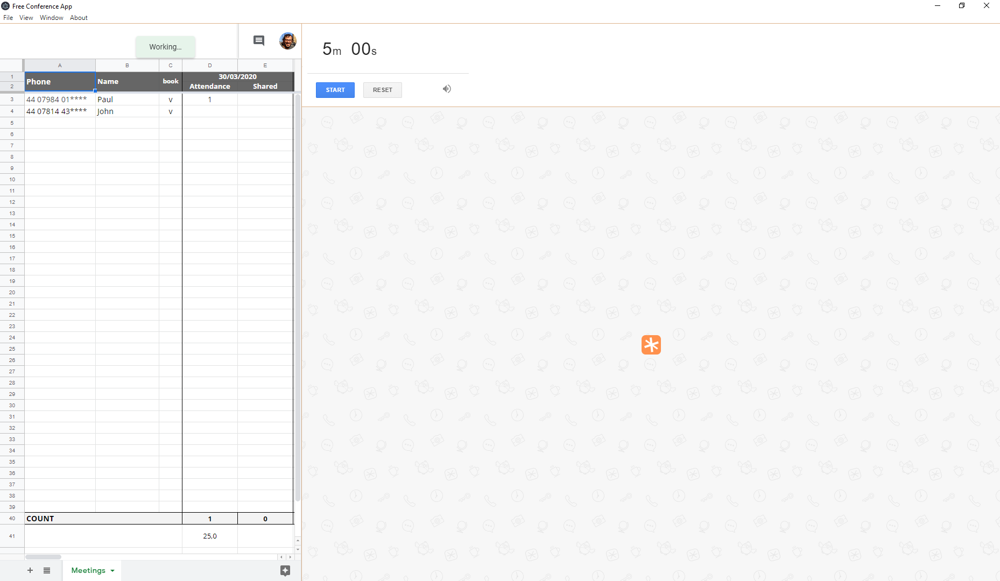
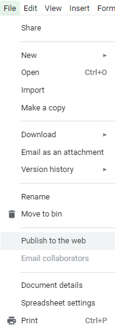
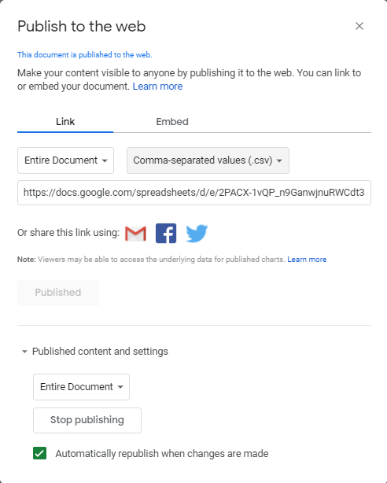
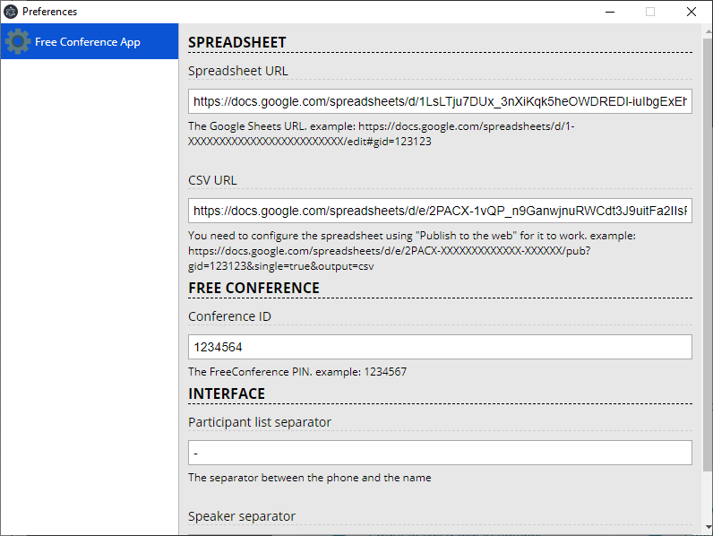

# FreeConference App

Creates a single space to help you managing people on the conference and visualising speaker times

## Download

Download the app on [the packages page](https://github.com/russoedu/free-conference-app/releases)

## Configuration
You will need a Google Sheets spreadsheet with at least two columns (Phone and Name). The rest of the columns don't mather.

You can use [this spreadsheet](https://docs.google.com/spreadsheets/d/1GrR8AM1DJQOzL-v3fLUJtxaIi6P9dD44hz-IBGbmKk4/) as a base for your meetings. Just make a copy and follow the instructions below to use it on the app.

To run the app you need to configure the Google Sheet that will be displayed on the left side by clicking on `file` and then `Publish to the web`

Please make sure the configuration of the publishing is set to `CSV`

Copy this URL. It will be used to configure the app.

On the app preferences, make sure you fill all the required data and then hit the reload button.

The required data are:

- Spreadsheet URL
- CSV URL
- Conference ID

The app is ready for your meetings!
